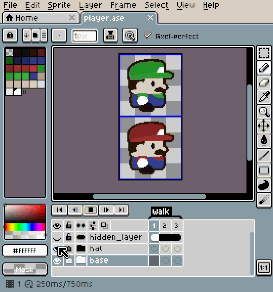
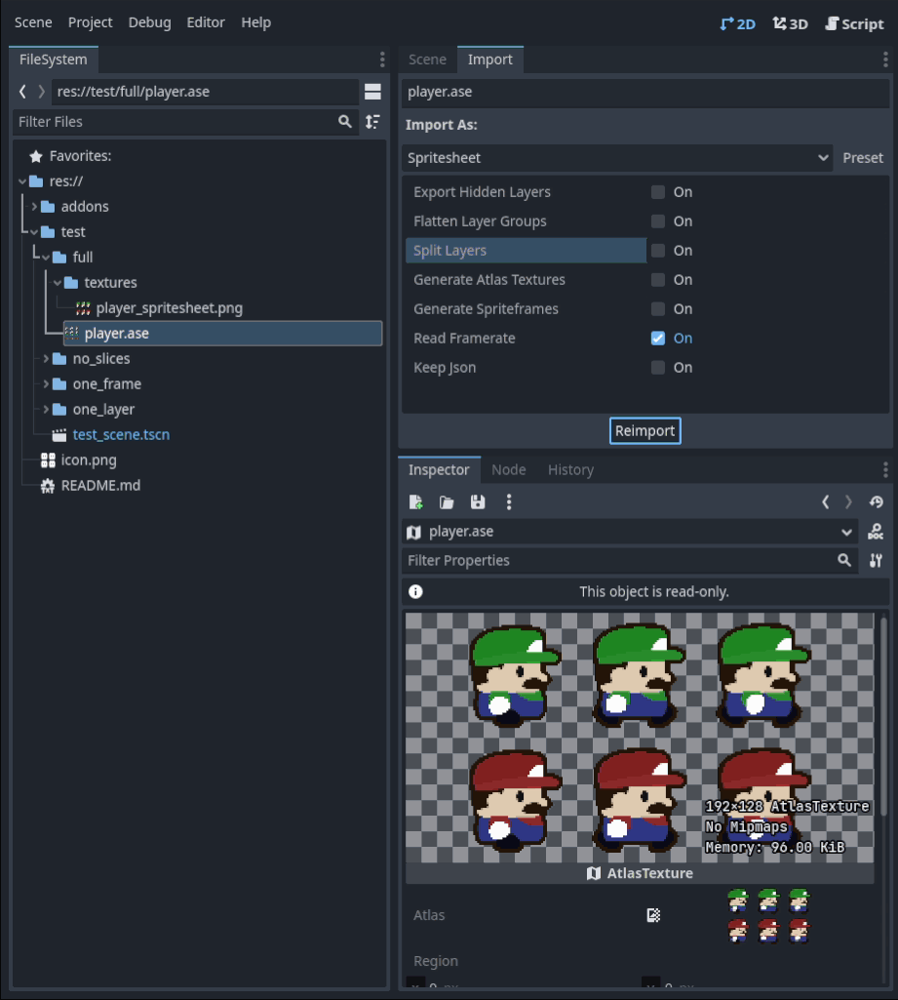
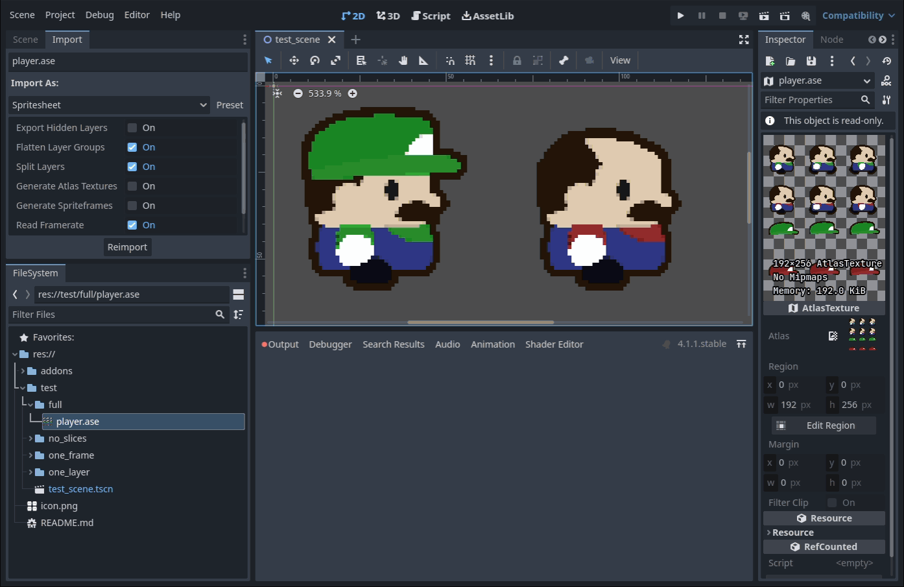

#  Godot Aseprite Spritesheet Importer

A simple yet powerful Godot plugin designed to streamline importing spritesheets and animations from Aseprite.

Thanks to Kenney.nl for the sprites used in these examples

## Key Features

- **Support for multiple Layers, Frames, and Slices**: Supports complex Aseprite files with multiple characters or images organized using Layer Groups and/or Slices. This is very useful if you want to make a character with both the body and equipment in the same file.

- **Support for nine-patch StyleBox**: Useful for creating GUI elements.

- **Resource focus**: This plugin focuses on creating Resources (ie. SpriteFrames, AtlasTexture, Stylebox) rather than Nodes or Scenes (eg. AnimatedSprite2D, AnimatedSprite3D, or AnimationPlayer).

## Import Options

- **Export Hidden Layers** - Makes all layers visible before export.

- **Flatten Layer Groups** - Flattens top-level Layer Groups before export (useful when combined with Split Layers).

- **Split Layers** - Splits layers into their own area of the spritesheet.

- **Generate Atlas Textures** - Generate AtlasTexture (Texture2D) Resources for each subregion of the spritesheet - this respects both Slices, Layers (when used with Split Layers) and 9-patch Slices (for StyleBox)

- **Generate SpriteFrames** - Generate SpriteFrames Resource(s) that has an animation for each Tag (or "default" if there is no tag).

- **Read Framerate** - Uses the frame delay configured in Aseprite to set the FPS and individual frame delay of each animation within an exported SpriteFrames.

- **Keep JSON** - Keep the JSON datafile instead of cleaning it up after export. Useful for debugging purposes.

## Import hints

The import hints used for the addon were chosen to match the import hints for [the official Godot Blender plugin](https://docs.godotengine.org/en/stable/tutorials/assets_pipeline/importing_scenes.html#import-hints)

### Slices

Any Aseprite Slice with the suffix `-noimp` will be ignored when creating AtlasTexture Resources (although the images will still be exported as part of the spritesheet png).

### Animations

Any Aseprite Tags with the suffix `-noimp` will be ignored when creating SpriteFrames Resources (although the images will still be exported as part of the spritesheet png).

Tags with the suffix `loop` or `cycle` will be set as looping within the SpriteFrames animation.

## How to Use

1. **Installation**:
   - Download the plugin from the [release page](https://github.com/colinheathman/godot-aseprite-spritesheet-importer/releases).
   - Extract the plugin folder into your Godot project's `addons` directory.

2. **Configuration**:
   - Open your Godot project.
   - Navigate to `Project > Project Settings > Plugins`.
   - Enable the "Aseprite Spritesheet Importer" plugin.

3. **Custom install location for Aseprite**:
   - If you've installed Aseprite to a custom location (or you're using the Steam version)
   - Navigate to `Editor > Editor Settings > Aseprite > General`.
   - Configure the `Command Path` to the path of the aseprite executable.
	   - MacOS Default: "/Applications/Aseprite.app/Contents/MacOS/aseprite"
	   - Windows Default: "%ProgramFiles%\\Aseprite\\Aseprite.exe"
	   - Otherwise: "aseprite"

4. **Usage**:
   - Once activated, `.ase` and `.aseprite` files will show up in the FileSystem dock.
   - Select the Aseprite file you want to import.
   - Configure any additional settings based in the import dock `Import > Spritesheet`.
   - Click 'Import' to generate the resources in a `textures` folder next to the Aseprite file.

## Compatibility

This addon was developed using Godot 4.1.1.stable, and should work with any 4.x version

The addon should also be compatible with [Aseprite Wizard](https://github.com/viniciusgerevini/godot-aseprite-wizard) if you want to use both in your project.

## Support and Contribution

If you encounter any issues or have suggestions for improvement, please [open an issue](https://github.com/colinheathman/godot-aseprite-spritesheet-importer/issues) on the GitHub repository.

## License

This plugin is licensed under [MIT License](https://github.com/colinheathman/godot-aseprite-spritesheet-importer/blob/main/LICENSE).

## Disclaimer

This plugin is not affiliated with Aseprite, or its developers.
